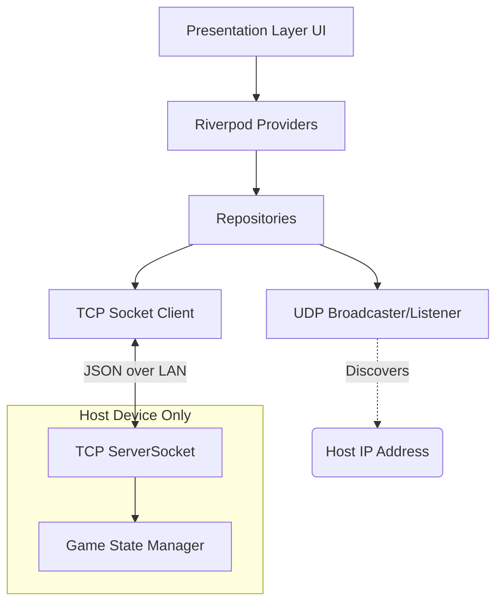

# System Architecture

## Core Tech Stack
- **Framework:** Flutter (latest stable)
- **Language:** Dart
- **Target OS:** Android only (for MVP)

## Architectural Decisions

### State Management: Riverpod
**Justification:** Riverpod is the ideal choice because of its excellent integration with Streams and Futures, which are heavily used in networking (socket connections, discovery events). It allows for reactive rebuilds when network states change, ensures memory safety (auto-dispose), and makes dependency injection for testing networking layers trivial.

### Architecture Pattern: Feature-First Clean Architecture
The codebase will be divided by features rather than purely by layers (like having all models in one folder). Inside each feature, we'll enforce separation of concerns.

```text
lib/
├── core/                   # Shared utilities, routing, themes
│   ├── network/            # Low-level TCP/UDP abstractions
│   ├── theme/              # Colors, text styles
│   └── utils/              # Extensions, constants
├── features/
│   ├── discovery/          # Room finding (UDP broadcast)
│   │   ├── domain/         # Models (ServerInfo)
│   │   ├── data/           # UDP scanner repository
│   │   └── presentation/   # Room list UI, joining logic
│   ├── game_draw/          # The specific mini-game
│   │   ├── domain/         # Draw points, chat messages
│   │   ├── data/           # Game sync repository (TCP socket client)
│   │   └── presentation/   # Canvas, chat UI
│   └── host/               # Acting as the server
│       ├── domain/         # Room state, player list
│       ├── data/           # TCP Server socket
│       └── presentation/   # Lobby UI
└── main.dart
```

### Networking Architecture
- **Discovery Layer (UDP):** The host repeatedly broadcasts a lightweight JSON payload detailing their IP, Port, Room Name, and Game Type. Clients listen on a specific port to build a live list of available rooms.
- **Transport Layer (TCP Sockets):** Once a client selects a room, a direct TCP connection is established between the client and the host's IP. 
- **Justification:** We choose raw TCP Sockets over WebSockets because we do not have an HTTP server running. Raw Dart `ServerSocket` is extremely lightweight, uses less overhead, and handles persistent connections natively without needing a web abstraction layer.

## Module Dependency Diagram


