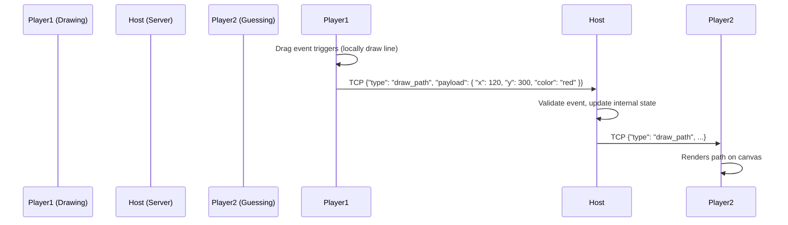

# Network Protocol Design

All networking for Pocket Party happens over local LAN. We use two distinct protocols: UDP for Room Discovery and TCP for reliable Game State synchronization.

## 1. Discovery Protocol (UDP Broadcast)

**Port:** `44444` (or any available high port, configurable)
**Interval:** Host broadcasts every 2 seconds.

### Payload Format (JSON string)
```json
{
  "type": "discovery",
  "roomName": "Manoj's Party",
  "hostName": "Manoj",
  "gameType": "draw_guess",
  "playersCount": 3,
  "maxPlayers": 8,
  "tcpPort": 55555,
  "version": "1.0"
}
```

## 2. Synchronization Protocol (TCP Sockets)

**Protocol Formatting:** To handle TCP streaming (where packets can be split or concatenated), all messages will be delimited by a newline character `\n` (JSON Lines format). 

### Connection Flow
1. Client connects to Host's TCP Port.
2. Client sends a `join_request`.
3. Host responds with `join_accept` (assigning a player ID) or `join_reject`.
4. Host broadcasts `player_joined` to all other connected clients.

### Message Envelopes (JSON)

Every message follows a standard envelope structure:
```json
{
  "type": "<message_type>",
  "senderId": "<uuid>",
  "timestamp": 1684343212,
  "payload": { ... }
}
```

### Event Flow: Drawing Synchronization



### Primary Event Types
- `join_request`: Client requests to enter lobby.
- `join_accept` / `join_reject`: Server response.
- `lobby_update`: Server broadcasts current player list.
- `game_start`: Server signals clients to shift to the game screen.
- `draw_path`: Batch of drawing coordinates.
- `chat_message`: Text sent by players guessing.
- `round_end`: Server broadcasts results of the round.
- `error`: E.g., "Kicked by host", "Room full".
